# ERD (Entity Relationship Diagram)
## 남해군 노인 복지 추천 웹사이트 데이터베이스 설계

### 1. 개체 (Entity) 정의

#### 1.1 사용자 관련 개체

**Users (사용자)**
- 설문 참여자의 기본 정보를 암호화하여 저장
- 익명 키를 통한 개인정보 보호

**Survey_Sessions (설문 세션)**  
- 설문 진행 상태 및 임시 저장 데이터 관리
- 단계별 진행 상황 추적

**Survey_Responses (설문 응답)**
- 각 질문에 대한 사용자 응답 저장
- 카테고리별 응답 데이터 관리

#### 1.2 설문 관련 개체

**Survey_Questions (설문 질문)**
- 설문 질문 내용 및 옵션 관리
- 카테고리별 질문 분류

**Question_Options (질문 옵션)**
- 각 질문의 선택지 관리
- 점수 및 가중치 정보 포함

#### 1.3 복지 관련 개체

**Welfare_Services (복지 서비스)**
- 남해군 복지 혜택 정보 관리
- 신청 조건 및 혜택 내용 저장

**Welfare_Categories (복지 카테고리)**
- 복지 서비스 분류 관리
- 건강의료, 생활지원, 경제활동, 사회참여

**Eligibility_Criteria (자격 기준)**
- 복지 서비스별 신청 자격 조건
- 연령, 소득, 거주지 등 조건 관리

#### 1.4 추천 관련 개체

**Recommendations (추천 결과)**
- AI 기반 복지 추천 결과 저장
- 사용자별 맞춤형 추천 내역

**Recommendation_Scores (추천 점수)**
- 각 복지 서비스별 추천 점수
- 우선순위 계산 근거 데이터

### 2. 속성 (Attributes) 정의

#### 2.1 Users 테이블
```sql
Users (
    user_id UUID PRIMARY KEY,
    user_key VARCHAR(50) UNIQUE NOT NULL,     -- 익명 조회 키
    encrypted_name TEXT NOT NULL,             -- 암호화된 이름
    encrypted_birth_date TEXT NOT NULL,       -- 암호화된 생년월일
    encrypted_address TEXT NOT NULL,          -- 암호화된 주소
    district_code VARCHAR(10) NOT NULL,       -- 읍/면/동 코드
    age_group VARCHAR(10) NOT NULL,           -- 연령대 (65-69, 70-74, 등)
    created_at TIMESTAMP DEFAULT CURRENT_TIMESTAMP,
    updated_at TIMESTAMP DEFAULT CURRENT_TIMESTAMP,
    expires_at TIMESTAMP,                     -- 데이터 만료 시간
    is_active BOOLEAN DEFAULT TRUE
);
```

#### 2.2 Survey_Sessions 테이블
```sql
Survey_Sessions (
    session_id UUID PRIMARY KEY,
    user_id UUID REFERENCES Users(user_id),
    current_step INTEGER DEFAULT 1,           -- 현재 진행 단계
    total_steps INTEGER DEFAULT 4,            -- 전체 단계 수
    progress_percentage INTEGER DEFAULT 0,    -- 진행률 (0-100)
    start_time TIMESTAMP DEFAULT CURRENT_TIMESTAMP,
    last_activity TIMESTAMP DEFAULT CURRENT_TIMESTAMP,
    completion_time TIMESTAMP,
    session_status VARCHAR(20) DEFAULT 'in_progress',  -- in_progress, completed, abandoned
    temporary_data JSONB,                     -- 임시 저장 데이터
    created_at TIMESTAMP DEFAULT CURRENT_TIMESTAMP,
    updated_at TIMESTAMP DEFAULT CURRENT_TIMESTAMP
);
```

#### 2.3 Survey_Questions 테이블
```sql
Survey_Questions (
    question_id UUID PRIMARY KEY,
    category_id INTEGER NOT NULL,             -- 1:건강, 2:생활, 3:경제, 4:사회
    question_text TEXT NOT NULL,
    question_type VARCHAR(20) NOT NULL,       -- single_choice, multiple_choice, scale
    question_order INTEGER NOT NULL,
    weight_factor DECIMAL(3,2) DEFAULT 1.00,
    is_required BOOLEAN DEFAULT TRUE,
    audio_url VARCHAR(255),                   -- 음성 안내 파일 URL
    created_at TIMESTAMP DEFAULT CURRENT_TIMESTAMP,
    updated_at TIMESTAMP DEFAULT CURRENT_TIMESTAMP,
    is_active BOOLEAN DEFAULT TRUE
);
```

#### 2.4 Question_Options 테이블
```sql
Question_Options (
    option_id UUID PRIMARY KEY,
    question_id UUID REFERENCES Survey_Questions(question_id),
    option_text TEXT NOT NULL,
    option_value VARCHAR(50) NOT NULL,
    score_value INTEGER DEFAULT 0,           -- 점수 (0-100)
    option_order INTEGER NOT NULL,
    created_at TIMESTAMP DEFAULT CURRENT_TIMESTAMP,
    is_active BOOLEAN DEFAULT TRUE
);
```

#### 2.5 Survey_Responses 테이블
```sql
Survey_Responses (
    response_id UUID PRIMARY KEY,
    session_id UUID REFERENCES Survey_Sessions(session_id),
    user_id UUID REFERENCES Users(user_id),
    question_id UUID REFERENCES Survey_Questions(question_id),
    selected_options JSONB NOT NULL,         -- 선택한 옵션들
    response_score INTEGER DEFAULT 0,
    response_time TIMESTAMP DEFAULT CURRENT_TIMESTAMP,
    created_at TIMESTAMP DEFAULT CURRENT_TIMESTAMP
);
```

#### 2.6 Welfare_Categories 테이블
```sql
Welfare_Categories (
    category_id INTEGER PRIMARY KEY,
    category_name VARCHAR(50) NOT NULL,
    category_description TEXT,
    icon_url VARCHAR(255),
    display_order INTEGER NOT NULL,
    created_at TIMESTAMP DEFAULT CURRENT_TIMESTAMP,
    is_active BOOLEAN DEFAULT TRUE
);
```

#### 2.7 Welfare_Services 테이블
```sql
Welfare_Services (
    service_id UUID PRIMARY KEY,
    category_id INTEGER REFERENCES Welfare_Categories(category_id),
    service_name VARCHAR(100) NOT NULL,
    service_description TEXT NOT NULL,
    benefit_amount VARCHAR(50),               -- 지원 금액
    benefit_type VARCHAR(30),                 -- 현금, 현물, 서비스
    application_method TEXT,                  -- 신청 방법
    required_documents TEXT,                  -- 필요 서류
    contact_info TEXT,                        -- 담당 부서 연락처
    application_url VARCHAR(255),             -- 온라인 신청 링크
    service_duration VARCHAR(50),             -- 지원 기간
    renewal_required BOOLEAN DEFAULT FALSE,   -- 갱신 필요 여부
    created_at TIMESTAMP DEFAULT CURRENT_TIMESTAMP,
    updated_at TIMESTAMP DEFAULT CURRENT_TIMESTAMP,
    is_active BOOLEAN DEFAULT TRUE
);
```

#### 2.8 Eligibility_Criteria 테이블
```sql
Eligibility_Criteria (
    criteria_id UUID PRIMARY KEY,
    service_id UUID REFERENCES Welfare_Services(service_id),
    criteria_type VARCHAR(20) NOT NULL,       -- age, income, residence, health, etc.
    criteria_value JSONB NOT NULL,            -- 조건 값 (JSON 형태)
    criteria_operator VARCHAR(10) NOT NULL,   -- >=, <=, =, IN, NOT IN
    priority_level INTEGER DEFAULT 1,         -- 우선순위 (1-5)
    created_at TIMESTAMP DEFAULT CURRENT_TIMESTAMP,
    is_active BOOLEAN DEFAULT TRUE
);
```

#### 2.9 Recommendations 테이블
```sql
Recommendations (
    recommendation_id UUID PRIMARY KEY,
    user_id UUID REFERENCES Users(user_id),
    session_id UUID REFERENCES Survey_Sessions(session_id),
    recommended_services JSONB NOT NULL,      -- 추천 서비스 목록
    recommendation_reason TEXT,               -- 추천 사유
    ai_confidence_score DECIMAL(5,2),         -- AI 신뢰도 점수
    generation_method VARCHAR(20),            -- rule_based, ai_enhanced
    created_at TIMESTAMP DEFAULT CURRENT_TIMESTAMP,
    viewed_at TIMESTAMP,
    is_viewed BOOLEAN DEFAULT FALSE
);
```

#### 2.10 Recommendation_Scores 테이블
```sql
Recommendation_Scores (
    score_id UUID PRIMARY KEY,
    recommendation_id UUID REFERENCES Recommendations(recommendation_id),
    service_id UUID REFERENCES Welfare_Services(service_id),
    compatibility_score INTEGER NOT NULL,     -- 적합도 점수 (0-100)
    priority_rank INTEGER NOT NULL,          -- 우선순위 순위
    score_factors JSONB,                      -- 점수 계산 근거
    created_at TIMESTAMP DEFAULT CURRENT_TIMESTAMP
);
```

### 3. 관계 (Relationships) 정의

#### 3.1 주요 관계 유형

**Users ↔ Survey_Sessions (1:N)**
- 한 사용자가 여러 설문 세션을 가질 수 있음
- 재설문 및 이력 관리

**Survey_Sessions ↔ Survey_Responses (1:N)**
- 한 설문 세션에 여러 응답이 속함
- 설문 진행 상태 추적

**Survey_Questions ↔ Question_Options (1:N)**
- 한 질문에 여러 선택지가 존재
- 질문 유형에 따른 옵션 관리

**Welfare_Categories ↔ Welfare_Services (1:N)**
- 한 카테고리에 여러 복지 서비스가 속함
- 복지 서비스 분류 체계

**Welfare_Services ↔ Eligibility_Criteria (1:N)**
- 한 복지 서비스에 여러 자격 조건이 존재
- 복합 조건 처리

**Users ↔ Recommendations (1:N)**
- 한 사용자가 여러 추천 결과를 가질 수 있음
- 추천 이력 관리

**Recommendations ↔ Recommendation_Scores (1:N)**
- 한 추천 결과에 여러 서비스별 점수가 존재
- 우선순위 계산

### 4. Mermaid ER 다이어그램

```mermaid
erDiagram
    Users {
        UUID user_id PK
        VARCHAR user_key UK
        TEXT encrypted_name
        TEXT encrypted_birth_date
        TEXT encrypted_address
        VARCHAR district_code
        VARCHAR age_group
        TIMESTAMP created_at
        TIMESTAMP updated_at
        TIMESTAMP expires_at
        BOOLEAN is_active
    }
    
    Survey_Sessions {
        UUID session_id PK
        UUID user_id FK
        INTEGER current_step
        INTEGER total_steps
        INTEGER progress_percentage
        TIMESTAMP start_time
        TIMESTAMP last_activity
        TIMESTAMP completion_time
        VARCHAR session_status
        JSONB temporary_data
        TIMESTAMP created_at
        TIMESTAMP updated_at
    }
    
    Survey_Questions {
        UUID question_id PK
        INTEGER category_id
        TEXT question_text
        VARCHAR question_type
        INTEGER question_order
        DECIMAL weight_factor
        BOOLEAN is_required
        VARCHAR audio_url
        TIMESTAMP created_at
        TIMESTAMP updated_at
        BOOLEAN is_active
    }
    
    Question_Options {
        UUID option_id PK
        UUID question_id FK
        TEXT option_text
        VARCHAR option_value
        INTEGER score_value
        INTEGER option_order
        TIMESTAMP created_at
        BOOLEAN is_active
    }
    
    Survey_Responses {
        UUID response_id PK
        UUID session_id FK
        UUID user_id FK
        UUID question_id FK
        JSONB selected_options
        INTEGER response_score
        TIMESTAMP response_time
        TIMESTAMP created_at
    }
    
    Welfare_Categories {
        INTEGER category_id PK
        VARCHAR category_name
        TEXT category_description
        VARCHAR icon_url
        INTEGER display_order
        TIMESTAMP created_at
        BOOLEAN is_active
    }
    
    Welfare_Services {
        UUID service_id PK
        INTEGER category_id FK
        VARCHAR service_name
        TEXT service_description
        VARCHAR benefit_amount
        VARCHAR benefit_type
        TEXT application_method
        TEXT required_documents
        TEXT contact_info
        VARCHAR application_url
        VARCHAR service_duration
        BOOLEAN renewal_required
        TIMESTAMP created_at
        TIMESTAMP updated_at
        BOOLEAN is_active
    }
    
    Eligibility_Criteria {
        UUID criteria_id PK
        UUID service_id FK
        VARCHAR criteria_type
        JSONB criteria_value
        VARCHAR criteria_operator
        INTEGER priority_level
        TIMESTAMP created_at
        BOOLEAN is_active
    }
    
    Recommendations {
        UUID recommendation_id PK
        UUID user_id FK
        UUID session_id FK
        JSONB recommended_services
        TEXT recommendation_reason
        DECIMAL ai_confidence_score
        VARCHAR generation_method
        TIMESTAMP created_at
        TIMESTAMP viewed_at
        BOOLEAN is_viewed
    }
    
    Recommendation_Scores {
        UUID score_id PK
        UUID recommendation_id FK
        UUID service_id FK
        INTEGER compatibility_score
        INTEGER priority_rank
        JSONB score_factors
        TIMESTAMP created_at
    }
    
    Users ||--o{ Survey_Sessions : "participates in"
    Survey_Sessions ||--o{ Survey_Responses : "contains"
    Survey_Questions ||--o{ Question_Options : "has"
    Survey_Questions ||--o{ Survey_Responses : "answered in"
    Welfare_Categories ||--o{ Welfare_Services : "contains"
    Welfare_Services ||--o{ Eligibility_Criteria : "has"
    Users ||--o{ Recommendations : "receives"
    Survey_Sessions ||--o{ Recommendations : "generates"
    Recommendations ||--o{ Recommendation_Scores : "scored by"
    Welfare_Services ||--o{ Recommendation_Scores : "included in"
```



### 5. 인덱스 (Indexes) 전략

#### 5.1 성능 최적화 인덱스
```sql
-- 사용자 조회 성능 향상
CREATE INDEX idx_users_user_key ON Users(user_key);
CREATE INDEX idx_users_district_age ON Users(district_code, age_group);

-- 설문 세션 조회 성능 향상
CREATE INDEX idx_survey_sessions_user_status ON Survey_Sessions(user_id, session_status);
CREATE INDEX idx_survey_sessions_activity ON Survey_Sessions(last_activity);

-- 설문 응답 조회 성능 향상
CREATE INDEX idx_survey_responses_session ON Survey_Responses(session_id);
CREATE INDEX idx_survey_responses_user_question ON Survey_Responses(user_id, question_id);

-- 복지 서비스 검색 성능 향상
CREATE INDEX idx_welfare_services_category ON Welfare_Services(category_id);
CREATE INDEX idx_welfare_services_active ON Welfare_Services(is_active);

-- 자격 조건 검색 성능 향상
CREATE INDEX idx_eligibility_criteria_service ON Eligibility_Criteria(service_id);
CREATE INDEX idx_eligibility_criteria_type ON Eligibility_Criteria(criteria_type);

-- 추천 결과 조회 성능 향상
CREATE INDEX idx_recommendations_user ON Recommendations(user_id);
CREATE INDEX idx_recommendations_created ON Recommendations(created_at);
CREATE INDEX idx_recommendation_scores_recommendation ON Recommendation_Scores(recommendation_id);
```

#### 5.2 복합 인덱스
```sql
-- 설문 질문 정렬 및 검색
CREATE INDEX idx_survey_questions_category_order ON Survey_Questions(category_id, question_order);

-- 질문 옵션 정렬
CREATE INDEX idx_question_options_question_order ON Question_Options(question_id, option_order);

-- 추천 점수 정렬
CREATE INDEX idx_recommendation_scores_rec_rank ON Recommendation_Scores(recommendation_id, priority_rank);
```

### 6. 데이터 정규화

#### 6.1 정규화 수준: 3NF (Third Normal Form)

**1NF (First Normal Form)**
- 모든 속성이 원자값 (Atomic Value)
- 반복 그룹 제거
- JSONB 컬럼은 반구조화 데이터로 예외적 허용

**2NF (Second Normal Form)**
- 1NF 만족
- 부분 함수 종속성 제거
- 모든 비주요 속성이 기본키에 완전 함수 종속

**3NF (Third Normal Form)**
- 2NF 만족
- 이행 함수 종속성 제거
- 복지 카테고리 분리로 중복 제거

#### 6.2 반정규화 고려사항

**성능 향상을 위한 반정규화**
- `Survey_Responses.response_score`: 계산 결과 저장
- `Recommendations.recommended_services`: JSON 형태로 비정규화
- `Users.age_group`: 계산된 연령대 저장

### 7. 데이터 보안

#### 7.1 개인정보 암호화
```sql
-- 암호화 함수 예시
CREATE OR REPLACE FUNCTION encrypt_personal_data(plain_text TEXT)
RETURNS TEXT AS $$
BEGIN
    RETURN pgp_sym_encrypt(plain_text, 'your-secret-key');
END;
$$ LANGUAGE plpgsql;

-- 복호화 함수 예시
CREATE OR REPLACE FUNCTION decrypt_personal_data(encrypted_text TEXT)
RETURNS TEXT AS $$
BEGIN
    RETURN pgp_sym_decrypt(encrypted_text, 'your-secret-key');
END;
$$ LANGUAGE plpgsql;
```

#### 7.2 데이터 접근 제어
```sql
-- 개인정보 접근 권한 설정
CREATE ROLE welfare_admin;
CREATE ROLE welfare_user;

-- 암호화된 개인정보는 admin만 접근 가능
GRANT SELECT ON Users TO welfare_admin;
GRANT SELECT (user_id, user_key, district_code, age_group) ON Users TO welfare_user;

-- 설문 응답 및 추천 결과는 제한적 접근
GRANT SELECT, INSERT, UPDATE ON Survey_Responses TO welfare_user;
GRANT SELECT, INSERT, UPDATE ON Recommendations TO welfare_user;
```

### 8. 성능 최적화 전략

#### 8.1 쿼리 최적화
- **페이지네이션**: LIMIT/OFFSET 대신 커서 기반 페이징
- **조인 최적화**: 적절한 인덱스 활용
- **서브쿼리 최적화**: EXISTS 활용

#### 8.2 캐싱 전략
- **복지 서비스 정보**: Redis 캐싱 (1시간)
- **설문 질문**: 메모리 캐싱 (변경 시까지)
- **추천 결과**: 세션 기반 캐싱 (30분)

#### 8.3 데이터 보관 정책
```sql
-- 데이터 만료 처리
CREATE OR REPLACE FUNCTION cleanup_expired_data()
RETURNS VOID AS $$
BEGIN
    -- 만료된 사용자 데이터 삭제
    DELETE FROM Users WHERE expires_at < NOW();
    
    -- 완료되지 않은 오래된 세션 삭제
    DELETE FROM Survey_Sessions 
    WHERE session_status = 'in_progress' 
    AND last_activity < NOW() - INTERVAL '24 hours';
END;
$$ LANGUAGE plpgsql;

-- 자동 실행 스케줄링
SELECT cron.schedule('cleanup-expired-data', '0 2 * * *', 'SELECT cleanup_expired_data();');
```

### 9. 백업 및 복구

#### 9.1 백업 전략
```sql
-- 정기 백업 스크립트
pg_dump -h localhost -U welfare_user -d welfare_db -f backup_$(date +%Y%m%d_%H%M%S).sql

-- 증분 백업 (WAL 아카이빙)
archive_mode = on
archive_command = 'cp %p /backup/archive/%f'
```

#### 9.2 복구 전략
```sql
-- 전체 복구
psql -U welfare_user -d welfare_db -f backup_20240101_120000.sql

-- 특정 시점 복구 (PITR)
pg_basebackup -h localhost -U welfare_user -D /backup/base
```

### 10. 모니터링 및 유지보수

#### 10.1 성능 모니터링
```sql
-- 느린 쿼리 모니터링
SELECT query, calls, total_time, mean_time
FROM pg_stat_statements
ORDER BY total_time DESC
LIMIT 10;

-- 테이블 사용량 모니터링
SELECT schemaname, tablename, n_tup_ins, n_tup_upd, n_tup_del
FROM pg_stat_user_tables
ORDER BY n_tup_ins + n_tup_upd + n_tup_del DESC;
```

#### 10.2 정기 유지보수
```sql
-- 정기 VACUUM 및 ANALYZE
VACUUM ANALYZE Users;
VACUUM ANALYZE Survey_Responses;
VACUUM ANALYZE Recommendations;

-- 인덱스 재구성
REINDEX INDEX idx_users_user_key;
REINDEX INDEX idx_survey_responses_session;
```

---

**문서 작성일**: 2024년 1월  
**문서 버전**: v1.0  
**작성자**: 남해군 복지 추천 시스템 개발팀 