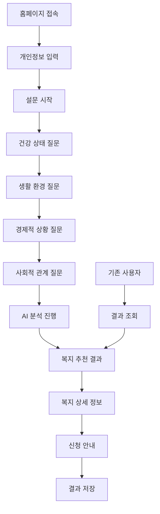

# IA (Information Architecture)
## 남해군 노인 복지 추천 웹사이트 정보 설계

### 1. 사이트맵 구조

#### 1.1 전체 사이트맵
```
남해군 노인 복지 추천 웹사이트 (/)
├── 홈페이지 (/)
├── 설문 시작 (/survey)
├── 설문 진행 (/survey/step/{step})
├── 복지 추천 결과 (/results/{userKey})
├── 복지 상세 정보 (/welfare/{id})
├── 신청 안내 (/application/{id})
├── 결과 조회 (/lookup)
├── 도움말 (/help)
└── 접근성 설정 (/accessibility)
```

#### 1.2 주요 페이지 구조
- **1단계**: 홈페이지 및 사용자 정보 입력
- **2단계**: 설문 조사 진행 (4개 카테고리)
- **3단계**: AI 기반 복지 추천 결과
- **4단계**: 복지 신청 안내 및 절차

### 2. 사용자 흐름 (User Flow)

#### 2.1 주요 사용자 여정


#### 2.2 상세 사용자 흐름

**Step 1: 서비스 시작**
1. 홈페이지 접속 → 서비스 소개 확인
2. '설문 시작' 버튼 클릭
3. 개인정보 입력 (이름, 생년월일, 거주지)
4. 개인정보 수집 동의

**Step 2: 설문 진행**
1. 건강 상태 설문 (5-7개 질문)
2. 생활 환경 설문 (5-7개 질문)
3. 경제적 상황 설문 (5-7개 질문)
4. 사회적 관계 설문 (5-7개 질문)

**Step 3: 결과 제공**
1. AI 분석 진행 (로딩 화면)
2. 맞춤형 복지 추천 결과 표시
3. 각 복지 혜택 상세 정보 제공
4. 우선순위 기반 정렬

**Step 4: 신청 안내**
1. 복지 신청 방법 안내
2. 필요 서류 목록 제공
3. 연락처 및 링크 제공
4. 결과 저장 및 조회 키 생성

### 3. 페이지별 구조 설계

#### 3.1 홈페이지 (/)
```
헤더 영역
├── 로고 (남해군 + 서비스명)
├── 접근성 도구 (글자 크기, 음성 안내, 고대비 모드)
└── 언어 선택 (한국어)

메인 영역
├── 서비스 소개 (큰 제목, 간단한 설명)
├── 이용 방법 (3단계 안내)
├── 시작하기 버튼 (큰 버튼)
└── 기존 결과 조회 링크

푸터 영역
├── 남해군청 정보
├── 개인정보 처리방침
└── 문의 연락처
```

#### 3.2 설문 페이지 (/survey/step/{step})
```
진행 상황 표시기
├── 단계 표시 (1/4, 2/4, 3/4, 4/4)
└── 진행률 바

설문 영역
├── 카테고리 제목
├── 질문 목록 (단일 선택 또는 다중 선택)
├── 각 질문별 음성 안내 버튼
└── 이전/다음 버튼

하단 고정 영역
├── 이전 단계 버튼
├── 다음 단계 버튼 (또는 결과 보기)
└── 임시 저장 버튼
```

#### 3.3 결과 페이지 (/results/{userKey})
```
결과 요약 영역
├── 사용자 기본 정보
├── 설문 완료 일시
└── 추천 복지 개수

추천 복지 목록
├── 복지 카드 형태 (우선순위 순)
├── 복지명, 간단 설명, 예상 혜택
├── 상세 보기 버튼
└── 신청 방법 버튼

하단 액션 영역
├── 결과 저장 버튼
├── 결과 공유 버튼
└── 다시 설문하기 버튼
```

### 4. 내비게이션 구조

#### 4.1 주 네비게이션
- **홈으로**: 언제든지 홈페이지로 돌아가기
- **설문 다시하기**: 새로운 설문 시작
- **결과 조회**: 기존 결과 확인
- **도움말**: 사용 방법 안내

#### 4.2 상황별 네비게이션
```
홈페이지: 시작하기 → 설문 → 결과 → 신청 안내
설문 진행: 이전 단계 ↔ 다음 단계
결과 화면: 상세 보기 → 신청 안내 → 새 설문
```

#### 4.3 브레드크럼 네비게이션
```
홈 > 설문 조사 > 건강 상태 질문
홈 > 복지 추천 결과 > 노인 돌봄 서비스
홈 > 신청 안내 > 생활 지원 서비스
```

### 5. URL 구조 설계

#### 5.1 URL 패턴
```
GET  /                          # 홈페이지
GET  /survey                    # 설문 시작
GET  /survey/step/1            # 건강 상태 설문
GET  /survey/step/2            # 생활 환경 설문
GET  /survey/step/3            # 경제적 상황 설문
GET  /survey/step/4            # 사회적 관계 설문
POST /survey/submit            # 설문 제출
GET  /results/{userKey}        # 복지 추천 결과
GET  /welfare/{id}             # 복지 상세 정보
GET  /application/{id}         # 신청 안내
GET  /lookup                   # 결과 조회
POST /lookup                   # 결과 조회 처리
GET  /help                     # 도움말
GET  /accessibility            # 접근성 설정
```

#### 5.2 API 엔드포인트
```
POST /api/users               # 사용자 정보 등록
GET  /api/survey/questions    # 설문 질문 조회
POST /api/survey/answers      # 설문 응답 저장
POST /api/recommendations     # AI 추천 요청
GET  /api/welfare/{id}        # 복지 정보 조회
GET  /api/results/{userKey}   # 결과 조회
```

### 6. 반응형 구성 전략

#### 6.1 브레이크포인트 정의
```scss
// Mobile First 접근
$breakpoints: (
  mobile: 0px,          // 320px ~ 767px
  tablet: 768px,        // 768px ~ 1023px
  desktop: 1024px,      // 1024px ~ 1279px
  large: 1280px         // 1280px 이상
);
```

#### 6.2 화면별 레이아웃 구성

**모바일 (320px ~ 767px)**
```
단일 컬럼 레이아웃
├── 헤더 (고정)
├── 메인 콘텐츠 (스크롤)
├── 하단 액션 바 (고정)
└── 플로팅 접근성 버튼
```

**태블릿 (768px ~ 1023px)**
```
2컬럼 레이아웃 (일부 섹션)
├── 헤더 (고정)
├── 사이드바 (선택적)
├── 메인 콘텐츠
└── 하단 액션 영역
```

**데스크톱 (1024px 이상)**
```
3컬럼 레이아웃 (복합 화면)
├── 헤더 (고정)
├── 사이드바 (네비게이션)
├── 메인 콘텐츠
├── 보조 정보 영역
└── 푸터
```

### 7. 콘텐츠 구조

#### 7.1 정보 계층 구조
```
Level 1: 서비스 소개 및 시작
├── Level 2: 개인정보 입력
├── Level 2: 설문 진행
│   ├── Level 3: 건강 상태
│   ├── Level 3: 생활 환경
│   ├── Level 3: 경제적 상황
│   └── Level 3: 사회적 관계
├── Level 2: 복지 추천 결과
│   ├── Level 3: 복지 상세 정보
│   └── Level 3: 신청 안내
└── Level 2: 결과 조회 및 관리
```

#### 7.2 콘텐츠 우선순위
1. **최고 우선순위**: 설문 진행 및 결과 확인
2. **높은 우선순위**: 복지 상세 정보 및 신청 안내
3. **중간 우선순위**: 결과 조회 및 설정 기능
4. **낮은 우선순위**: 도움말 및 부가 정보

### 8. 접근성 고려사항

#### 8.1 키보드 내비게이션
```
Tab 순서 정의
├── 주요 액션 버튼 (설문 시작, 다음, 이전)
├── 설문 응답 옵션 (라디오 버튼, 체크박스)
├── 보조 기능 (음성 안내, 글자 크기 조절)
└── 내비게이션 링크
```

#### 8.2 스크린 리더 지원
- **의미적 HTML 구조**: `<header>`, `<nav>`, `<main>`, `<section>`
- **적절한 헤딩 구조**: H1 > H2 > H3 순서
- **대체 텍스트**: 모든 이미지 및 아이콘
- **폼 라벨**: 모든 입력 필드 연결

#### 8.3 시각적 접근성
- **색상 대비**: WCAG 2.1 AA 수준 (4.5:1 이상)
- **글자 크기**: 기본 18px, 최대 24px
- **터치 대상**: 최소 44px × 44px
- **고대비 모드**: 선택 가능한 테마

### 9. 검색 및 필터링 구조

#### 9.1 복지 정보 분류
```
복지 카테고리
├── 건강 의료
│   ├── 의료비 지원
│   ├── 건강 검진
│   └── 장기 요양
├── 생활 지원
│   ├── 생계 급여
│   ├── 주거 지원
│   └── 돌봄 서비스
├── 경제 활동
│   ├── 일자리 지원
│   ├── 교육 지원
│   └── 창업 지원
└── 사회 참여
    ├── 문화 활동
    ├── 사회 봉사
    └── 교육 프로그램
```

#### 9.2 검색 기능
- **키워드 검색**: 복지 서비스명, 내용 검색
- **카테고리 필터**: 복지 유형별 분류
- **지역 필터**: 읍/면/동별 가능한 서비스
- **자격 조건**: 연령, 소득, 거주 조건

### 10. 성능 최적화 구조

#### 10.1 페이지 로딩 전략
- **Critical CSS**: 첫 화면 렌더링 최적화
- **Lazy Loading**: 이미지 및 비필수 콘텐츠
- **Progressive Enhancement**: 기본 기능부터 점진적 향상
- **Offline Support**: 기본 정보 캐싱

#### 10.2 콘텐츠 전략
- **최소 필수 정보**: 핵심 기능에 집중
- **단계별 로딩**: 필요한 시점에 콘텐츠 제공
- **텍스트 우선**: 이미지보다 텍스트 중심 구성
- **간결한 설명**: 핵심 정보만 포함

---

**문서 작성일**: 2024년 1월  
**문서 버전**: v1.0  
**작성자**: 남해군 복지 추천 시스템 개발팀 